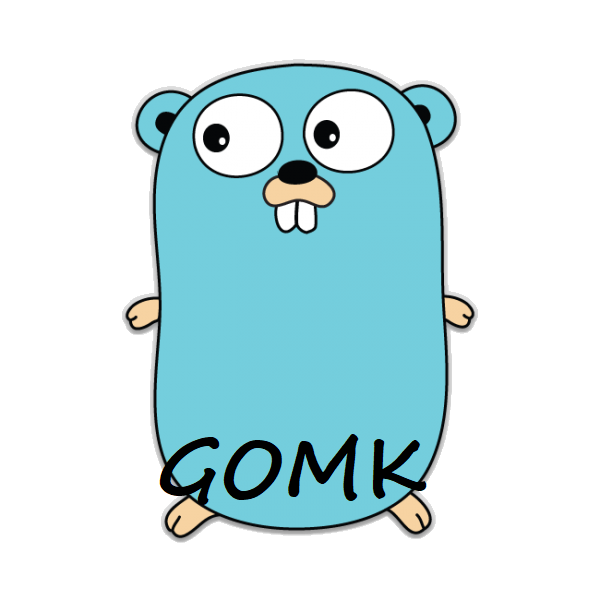

### About
---
Gomk is a json based build system for go applications written in go. You just have to define your targets and it is build the magic!

### Installation
---
```
git clone https://github.com/glanderson42/gomk
cd gomk
# todo
```

### Example
